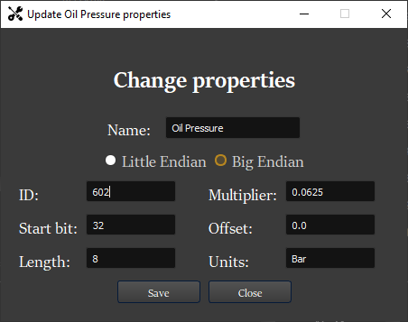

.. _CAN Settings:

************************
Can Message Settings
************************

| One of the key features of the application is the ability to set the CAN specification for individual variables.
| The list of all variables is in the case of dashboard displayed on the right side of the application.
| In case of other views, only those variables that occur in that view are listed.

| The user can open a settings window for any variable.
| This is done either by selecting one of the variables and then clicking on update button or by double-clicking on any of them.

|
| The user can set the following parameters:

    #. **Endian** - The user can choose between a small and a large endian.

    #. **ID** - CAN message identifier. Must be in HEX format with maximum length of 8 characters.

    #. **Start bit** - Bit offset in the data part of the CAN message. It must be within range 0 - 63.

    #. **Length** - Length of the region of interest in bits. Must be within range 1-63.

    #. **Multiplier** - Multiplier can be any real number.

    #. **Offset** - Offset can be any real number. Together with the multiplier they are used to get the real value from CAN message.

.. note::
    | In the current version of the application user cannot change the name, unit nor position or widget in which the variable will be displayed.
    | If necessary, these properties can be modified directly in the configuration file.
