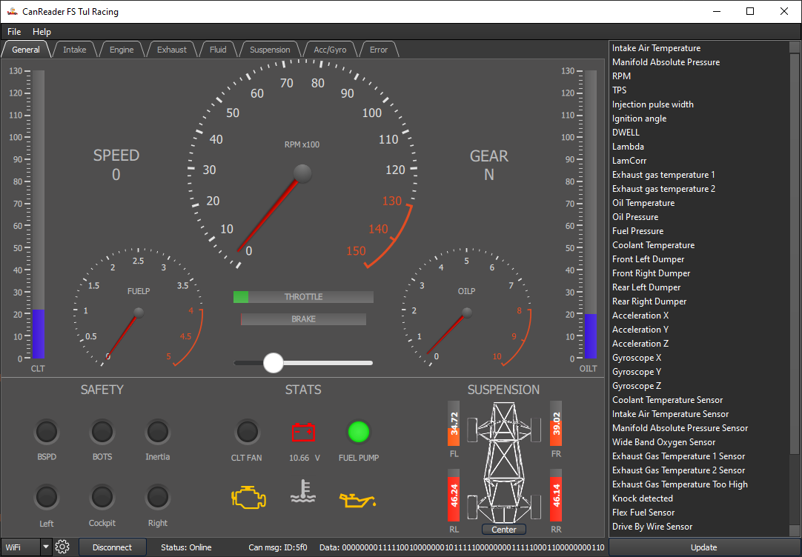

***********************
Display Types
***********************

.. _Dashboard:

Dashboard
==========

.. _Graph tab:

Graph tab
==========

| The second way of displaying data is to display individual variables in charts.
| Each tab forms a group of charts that are logically related.
| For example, the "Engine" tab displays engine-related data, such as RPM, valve opening, fuel injection time, etc.

.. image:: ../img/graph_tab_full.PNG
    :alt:   Graph tab

|
| Each graph can be controlled separately.
| The **left mouse button** is used to move arbitrarily in the graph.
| The **mouse wheel** controls zooming in or out.
| The **right mouse button** opens option menu.

| In the menu user can set axes range, grid display, drawing method, etc.
| There is also the option to export data in .csv format.
| Alternatively, the user can save the whole graph, or just a part of it, as an image in a standard format such as .png, .jpg or vector .svg.

| In the case user want to go back to the latest data,  he can do so by pressing the **"c"**  or the **"f"** key.

.. note::
    | At this version the user cannot add, move or remove individual charts directly in the application.
    | In case he would like to set what, where and in what order will be displayed, then he can edit the configuration file that contains all this information.

.. _Error tab:

Error tab
==========

| The last type of display is a panel showing errors of individual formula components.
| All indicators in this panel are connected to the binary variables.

|
| The indicator can take one of the following three states:

    #. **OK** - This state is indicated by a green indicator and means that everything is OK.

    #. **Error** - This state is indicated by a red indicator and indicates an occurrence of error. In addition to changing the indicator, the time when the error occurred and the restart button are displayed. The error does not disappear until the user manually restarts it. This ensures that the user is aware of the error, even if he is not currently on the error bar.

    #. **No data** - This state is indicated by a yellow indicator and means that the current state has not been received since startup, or last restart.
