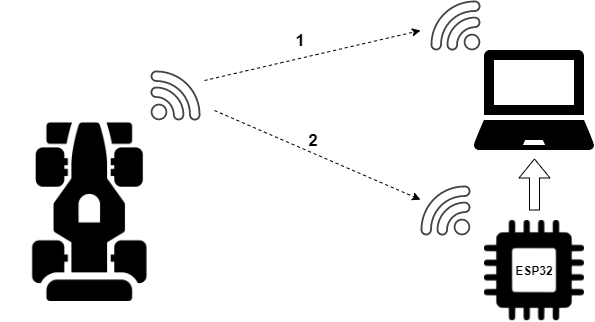
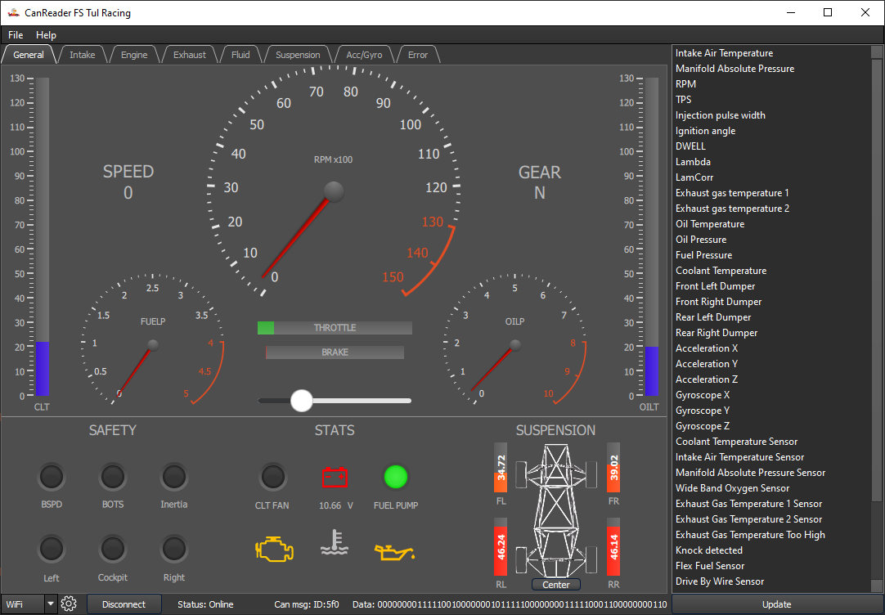
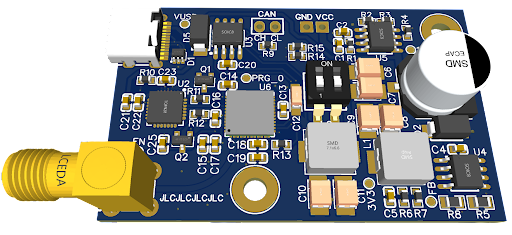

## Telemetry

* Designed for formula student team [FS TUL Racing](https://www.fstulracing.cz/).
* The system was developed as part of a bachelor's thesis.
* The goal of this project was to create a telemetry system which collects data from the CAN bus and sends them to the user for further processing and visualization.

1. **Formula -> User**
    * In this variant, the formula communicates directly to the user's PC via Wifi.
    * The advantage of this is the higTher transmission speed and simplicity of connection.
    * The disadvantage of this is the relatively limited range.
    
2. **Formula -> ESP32 -> User**
    * In this variant, the formula communicates with an intermediate member (ESP32-based device), which transmits the received data to the application via a serial port.
    * The advantage of this is a huge increase in range (theoretically over 1 km).
    * The disadvantage of this method is the limited transmission speed (250 kb/s) and the need for additional equipment.

## CAN Reader
* CAN Reader is application used to processed and visualize received CAN bus data.
* Source code can be found [here](https://github.com/GKPr0/Telemetry/tree/master/CanReader).
* For more info see [documentation](https://gkpr0.github.io/Telemetry/).

## FormulaShield
* This device is physically located in the formula.
* Its purpose is to send complete CAN communication to the connected client.
* Source code can be found [here](https://github.com/GKPr0/Telemetry/tree/master/HwShieldFormula)
* Hardware design can be found [Not ready]()

## ClientShield
* This device is connected to the user´s PC.
* Its purpose is to receive data from formula and pass them to the user.
* Used when longer communication range needed.
* Source code can be found [here](https://github.com/GKPr0/Telemetry/tree/master/HWShieldClient)
* Required hardware: ESP32 dev board (preferably with IPEX connector)
